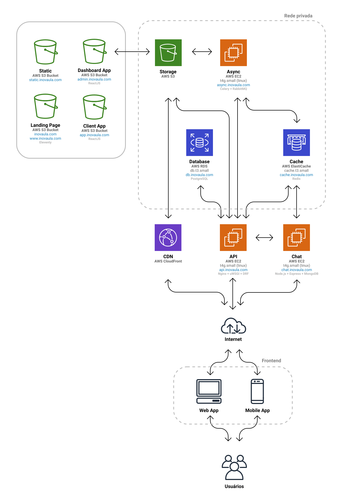

# Inovaula Documentação

---
## Visão Geral
Repositório base da documentação de desenvolvimento do projeto Inovaula.

A centralização da documentação dos componentes do sistema será feita nesse repositório a fim de facilitar o acesso e a troca de informação entre a equipe.

Para cada serviço ou produto há um diterório com documentação específica.

---
## Tabela de Conteúdo

- [Projeto](#projeto)
  - [Produtos](#produtos)
  - [Recursos](#recursos)
  - [Repositórios](#repositórios)
  - [Domínios](#domínios)
  - [Estrutura de arquivos](#estrutura-de-arquivos)
  - [Requisitos](#requisitos)
- [Design](#design)
  - [Design System](#design-system)
  - [Manual de marca](#manual-de-marca)
  - [Referências de Design](#referências-de-design)
- [Backend](#backend)
  - [API](#api)
  - [Chat](#chat)
  - [Async](#async)
  - [Cache](#cache)
  - [Database](#database)
  - [Storage](#storage)
- [Frontend](#frontend)
  - [Landing Page](#landing-page)
  - [Aplicativos Web](#aplicativos-web)
    - [Aplicativo Cliente](#aplicativo-cliente)
    - [Painel Administrativo](#painel-administrativo)
  - [Aplicativos Mobile](#aplicativos-mobile)
- [Infraestrutura](#Infraestrutura)
  - [Ambientes](#Ambientes)
  - [Diagrama de Infraestrutura](#diagrama-de-infraestrutura)
  - [Especificações e Valores de Infraestrutura](#especificações-e-valores-de-infraestrutura)
  - [Automação de Infraestrutura](#automação-de-infraestrutura)
- [Serviços](#Serviços)


---
## Projeto

Sistema de gestão e compartilhamento de experiências de aprendizagem.
[inovaula.com](https://inovaula.com)

### Produtos

O aplicativo principal voltado para os usuários clientes estará disponível em [app.inovaula.com](app.inovaula.com) e o painel administrativo estará disponível em [admin.inovaula.com](admin.inovaula.com).

### Recursos

- [Documentação](https://github.com/Inovaula/inovaula-docs) - Github
- [Arquivos]() - *Definir pasta compartilhada no Google Drive ou app similar*
- [Grupo de discussão](https://discord.com/channels/801055354182959114/801065664118652959) - Discord
- [Tracking](#) - Trello
- [Protótipo Lo-Fi Desktop](https://www.figma.com/proto/hhiqYHdyZdo1O8KeC6UM0m/Inovaula---Desktop%28Copy%29?node-id=433%3A4055&viewport=-1854%2C4672%2C1&scaling=min-zoom) - Figma
- [Protótipo Lo-Fi Mobile App](https://www.figma.com/proto/DrmnQPaUIpNRHccb3wU97U/Inovaula?node-id=251%3A1591&scaling=min-zoom) - Figma
- [Backlog](https://docs.google.com/spreadsheets/d/1NG8QkwEeJlQq4g3SZfgy7VEO43VEq_jV28as4WnfpRo/edit?usp=sharing) - Google Sheets

### Repositórios

- [inovaula-api](https://github.com/Inovaula/inovaula-api) - API principal.
- [inovaula-async](https://github.com/Inovaula/inovaula-async) - Serviço de tarefas assíncronas.
- [inovaula-chat](https://github.com/Inovaula/inovaula-chat) - Serviço de chat.
- [inovaula-docs](https://github.com/Inovaula/inovaula-docs) - Documentação do projeto.
- [inovaula-mobile](https://github.com/Inovaula/inovaula-mobile) - Aplicativos mobile.
- [inovaula-client](https://github.com/Inovaula/inovaula-client) - Aplicativo web público, principal.
- [inovaula-dashboard](https://github.com/Inovaula/inovaula-dashboard) - Aplicativo web privado, painel administrativo.
- [inovaula-landing](https://github.com/Inovaula/inovaula-landing) - Website público, principal.
- [inovaula-iac](https://github.com/Inovaula/inovaula-iac) - Infraestrutura e manutenção.

**Repositórios Legado**
Repositórios antigos, apenas para consulta:
- [frontend](https://github.com/Inovaula/frontinovaula.com)
- [backend](https://github.com/Inovaula/inovaula.com)
- [dashboard](https://github.com/Inovaula/dashboard)

### Domínios

- [inovaula.com](https://www.inovaula.com) | [www.inovaula.com](https://www.inovaula.com) - Landing page *(público)*
- [app.inovaula.com](https://app.inovaula.com) - Aplicativo principal *(público)*
- [admin.inovaula.com](https://admin.inovaula.com) - Painel administrativo *(público)*
- [static.inovaula.com](https://static.inovaula.com) - Servidor de arquivos estáticos *(público)*
- [api.inovaula.com](https://api.inovaula.com) - API principal *(público)*
- [chat.inovaula.com](https://chat.inovaula.com) - Serviço de chat *(público)*
- [async.inovaula.com](async.inovaula.com) - Serviço de fila e processamento de tarefas assíncronas de uso interno *(privado)*
- [cache.inovaula.com](cache.inovaula.com) - Camada de cache de uso interno compartilhada entre os serviços de **API**, **Chat** e **Async** *(privado)*
- [db.inovaula.com](db.inovaula.com) *(privado)*

### Estrutura de arquivos

Estrutura de arquivos.

```
inovaula
│
├── backend
│   ├── api
│   ├── async
│   ├── cache
│   ├── chat
│   └── database
├── design
│   ├── icons
│   ├── images
│   ├── logos
│   └── references
├── docs
│   ├── backend
│   ├── design
│   ├── frontend
│   ├── iac
│   └── project
│       └── structure     <-- we are here!
├── frontend
│   ├── mobile
│   └── web
│       ├── client
│       ├── dashboard
│       └── landing
├── iac
│   ├── aws
│   ├── backend
│   ├── frontend
│   └── maintenance
└── meta
    ├── credentials
    ├── meetings
    ├── messages
    ├── proposals
    ├── reports
    └── requirements
```

### Requisitos

Consulte a página dedicada à enumeração dos requisitos do projeto:

[Documentação de Requisitos](#)


---
## Design

Consulte a [Documentação de Design](#) para maiores detalhes.

> **NOTA:** Não é recomendado anexar arquivos (binários) grandes aqui nessa documentação. Veja na seção de [Recursos](#Recursos) o serviço definido para o armazenamento desses arquivos.


### Design System

Está acertado o uso do [Material Design](https://material.io/design) como linguagem de design para as interfaces de usuário e definido o **ReactJS** como framework para o desenvolvimento dos aplicativos **frontend**.

Consulte a [Documentação do Frontend](#Frontend) para detalhes de implementações e bibliotecas de componentes utilizadas.


#### Design Web

Está sob avaliação a utilização da [Material-UI](https://material-ui.com/) como biblioteca de componentes. Existe algumas versões pagas do kit de componentes para prototipagem em **Figma** disponíveis: [oficial](https://material-ui.com/store/items/figma-react/) e [alternativa](https://www.figma.com/community/file/880534892514982400). Apesar de ser a maior biblioteca de componentes para **ReactJS**, ainda não possui todos os componentes que utilizaremos, sendo necessário utilizar outros componentes compatíveis. Esse componentes compatíveis muitas vezes são prefixados com **mui**, como no caso do componente **RTE** (Rich Text Editor) que pode ser encontrado em [mui-rte](https://github.com/niuware/mui-rte).

#### Design Mobile

Estudar a viabilidade da utilização do [React Native Paper](https://reactnativepaper.com/) como bilbioteca de componentes e aplicação do **Material Design** para aplicativos desenvolvidos em **React Native**.


### Manual de marca


### Referências de Design

Material de referência necessário para a criação dos aplicativos **frontend**.

1. Protótipo responsivo do aplicativo web principal em alta fidelidade.
2. Protótipo responsivo do aplicativo web painel administrativo em alta fidelidade.
3. Layout dos templates de emails transacionais.
4. Layout da landing page.

---
## Backend

### API

Serviço modular escrito em **Python**, **Django** e **Django Rest Framework** e hospedado em instâncias **EC2** da **AWS**. Essa é a **API** principal do sistema, síncrona, utiliza arquitetura **REST** e é responsável pela autenticação dos usuários, regras de negócio e integrações com demais serviços próprios e de terceiros.

Módulos:

- **users** - Usuários
- **experiences** - Experiências de aprendizagem
- **tracks** - Trilhas de estudo
- **notes** - Anotações
- **questions** - Questões
- **calendars** - Calendário
- **activities** - Atividades
- **reminders** - Lembretes
- **files** - Bilbioteca de arquivos
- **attachments** - Anexos
- **payments** - Pagamentos
- **subscriptions** - Mensagens e grupos
- **notifications** - Notificações
- **emails** - Emails
- **faq** - Perguntas frequêntes
- **terms** - Termos de uso/políticas de privacidade e outros
- **blog** - Notícias
- **maintenance** - Configurações e manutenção
- **tasks** - Tarefas do sistema
- **statistics** - Estatísticas do sistema
- **chat** - Mensagens e grupos

Consulte a página principal da [Documentação da API](#) para maiores detalhes.

### Chat

Serviço em **JavaScript**, **Node.js**, **Express** e **MongoDB**, hospedado em uma instância **EC2** da **AWS**, responsável pela criação e manutenção de canais de conversação entre os usuários da plataforma através de **websockets**. Usuários autenticados podem ou não ter acesso ao serviço de chat mediante configuração prevista na **API** principal.

Consulte a página principal da [Documentação do Chat](#) para maiores detalhes.

### Async

Serviço de fila de processamento assíncrono desenvolvido em **Python**, **Celery**, **Redis** e **RabbitMQ**. O objetivo desse serviço é de evitar a sobrecarga da **API** principal com processos que possuem um longo tempo de execução.

Outra função desse serviço é o agendamento e a execução de tarefas agendadas.

### Cache

Serviço provido pela AWS ElastiCache.
Servidor Redis.

Esse componente será responsável por evitar chamadas desnecessárias ao banco de dados, promover troca de informação entre os serviços (**IPC**) e backend para algumas aplicações.

Alguns serviços e funções que dependem desse componente:
- Database queries cache
- API Throttling
- Chat
- Async

Consulte a página principal do [Documentação do Cache](#) para maiores detalhes.

### Database

Serviço provido pela AWS RDS.
Banco de dados relacional **PostgreSQL**.
Consulte a página principal da [Documentação da base de dados](#) para maiores detalhes sobre o *schema* e diagramas **ERD**.

- Espelhamento
- Escalabilidade
- Rotinas de backup

### Storage

Serviço provido pela **AWS S3**.

Esse serviço será o responsável pelo armazenamento de arquivos do sistema (uploads), landing pages e aplicativos web. Existe uma camada de distribuição (**CDN**) entre os usuários do sistema e esse serviço armazenamento, devido ao perfeito encaixe será utilizada a **AWS CloudFront** para essa operação.

- Segurança

---
## Frontend

Referência: [Comparativo entre tecnologias frontend](#https://gist.github.com/tkrotoff/b1caa4c3a185629299ec234d2314e190)

### Landing Page

A landing page estará disponível em um domínio a parte a fim de otimizar a indexação por mecanismos de busca e promover alto desempenho (web site estático). A API e o serviço de agendamento (parte do serviço de **Async**) será responsável por periodicamente atualizar o conteúdo da **landing page** com as novidades do sistema.

Estudar a possibilidade de utilizar o [Eleventy](#https://www.11ty.dev/) como framework para desenvolvimento da landing page. Esse framework é um dos mais modernos e apesar de ser estático, é possível criar estruturas complexas como por exemplo um blog.

Veja o [template google](#https://github.com/google/eleventy-high-performance-blog) para eleventy, no momento o único com 100% de SEO e todos os outros critérios de avaliação do google.

### Aplicativos Web


**Principais dependencias dos aplicativos web**
- [ReactJS](#https://reactjs.org/)
- [React Helmet](#https://github.com/nfl/react-helmet) - Otimização de SEO
- [Redux](#https://redux.js.org/)
- [Axios](#https://github.com/axios/axios)
- [Material UI](#https://material-ui.com/)

**Otimização de SEO**

Estudar a necessidade e viabilidade de utilizar o [Prerender.io](#https://prerender.io/)

#### Aplicativo Cliente

**Lista de telas**

#### Painel Administrativo

**Lista de telas**

### Aplicativos Mobile

Não estão previstos aplicativos mobile na primeira etapa de desenvolvimento, porém a documentação estará presente a fim pautar futuras discussões sobre o assunto.

A tecnologia compatível com o **frontend web**, com o qual é possível haver compartilhamento de códigos, é o **React Native**.

---
## Infraestrutura

### Ambientes

Está para ser definida a separação dos ambientes de desenvolvimento, staging e produção com as seguintes nomeclaturas:

- Desenvolvimento - `dev`
- Staging - `stag`
- Produção - `prod`

Inicialmente não há necessidade de implementar essa divisão até que uma versão alpha esteja definida e em ambiente de produção. A partir dessa implementação, serão adicionados à API, Database, Cache e Apps esses ambientes. Vale ressaltar o impacto financeiro dessa implementação.

### Diagrama de Infraestrutura



Original disponível em [Figma](https://www.figma.com/file/3puOoTX0fgQzHyjaXNdrp5/diagram?node-id=34928%3A108) baseado no template [aws-diagram-software](https://www.figma.com/templates/aws-diagram-software/).

Download em [PDF](iac/_res/inovaula-aws-infrastructure-diagram.svg?raw=true) | [PNG](iac/_res/inovaula-aws-infrastructure-diagram.png?raw=true) | [SVG](iac/_res/inovaula-aws-infrastructure-diagram.svg?raw=true).

### Especificações e Valores de Infraestrutura

> **NOTA:** Valores em Dólar americano (USD).

Alguns serviços não listados aqui têm menor impacto financeiro, esse é o caso por exemplo dos sistemas de arquivos **AWS EBS** utilizados como imagens dos sistemas operacionais das instâncias **AWS EC2** e do custo de transferância de dados para fora da **AWS**.

Servidores de arquivos estáticos na **AWS S3** possuem baixo custo para hospedar websites, principalmente quando distribuídos pela **AWS CloudFront**. Porém, a utilização da **AWS S3** como disco virtual dos usuários tem um custo que pode se tornar significativo de acordo com a quantidade de usuários, quota de armazenamento e frequência de acesso. Consultar [AWS S3 Pricing](https://aws.amazon.com/s3/pricing/) para maiores informações.

#### Servidores

| Serviço | vCPU | RAM | Instância | Sob demanda | Reserva 1 ano | Reserva 3 anos |
| --- | --- | --- | --- | ---: | ---: | ---: |
| API | 2 | 2GB | *t4g.small* | $0,0168/hora | $0,011/hora | $0,007/hora |
| Chat | 2 | 2GB | *t4g.small* | $0,0168/hora | $0,011/hora | $0,007/hora |
| Async | 2 | 2GB | *t4g.small* | $0,0168/hora | $0,011/hora | $0,007/hora |
| Cache | 1 | 1.5GB | *cache.t3.small* | $0,034/hora | $0,023/hora | $0,018/hora |
| Database | 2 | 2GB | *db.t3.small* | $0,036/hora | $0,026/hora | $0,017/hora |
| **Total** | - | - | - | **$86,688/mês** | **$59,04/mês** | **$40,32/mês** |

#### Controle de gastos

É recomendado configurar alertas de gastos com os serviços contratados através da **AWS CloudWatch**.

### Automação de Infraestrutura

Para assegurar conformidade e promover previsibilidade, será utilizado o [Ansible](https://github.com/ansible/ansible) para o desenvolvimento da automação de infraestrutura (IaC - Infrastructure as Code).

Lista de procedimentos e manual de uso dos **playbooks** do **Ansible**.

#### API
- **grant_access** - Liberar acesso **SSH** por **IP local** para instâncias dentro da rede privada na **VPC** da **AWS**.
- **revoke_access** - Retirar **IP local** da whitelist de acesso **SSH** às instâncias.
- **deploy_api** - Instalar, configurar e inicializar todos os componentes da API.
- **update_api** - Atualizar API de acordo com a última versão disponível no repositório do Github.
- **stop_api** - Parar servidor web (Nginx) e o gateway (uWSGI) da API.
- **start_api** - Iniciar servidor web (Nginx) e o gateway (uWSGI) da API.
- **restart_api** - Reiniciar servidor web (Nginx) e o gateway (uWSGI) da API.
- **collect_logs** - Coletar para ambiente local todos os logs da instância de API.

---
## Serviços

- **AWS SES** - Serviço de entrega de emails transacionais
- **AWS SNS** - Serviço de entrega de SMS
